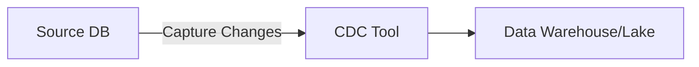
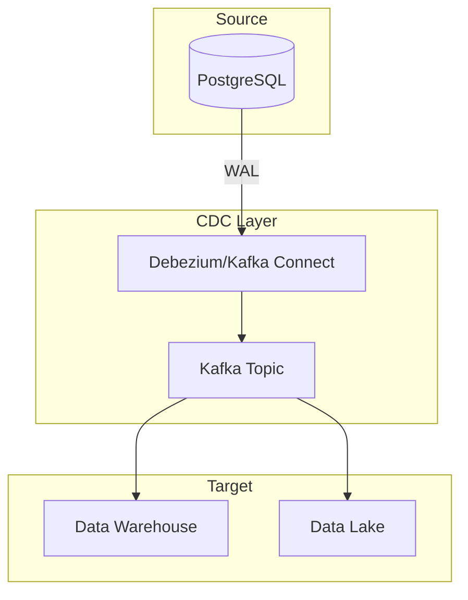
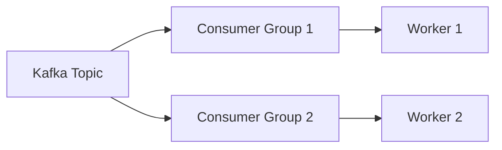
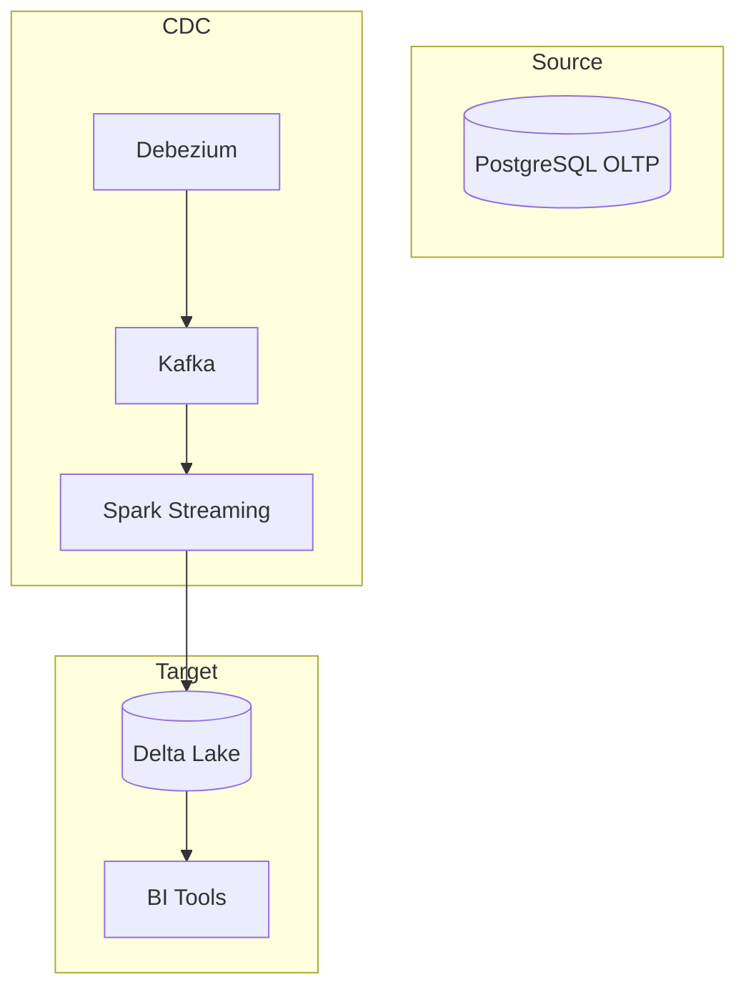
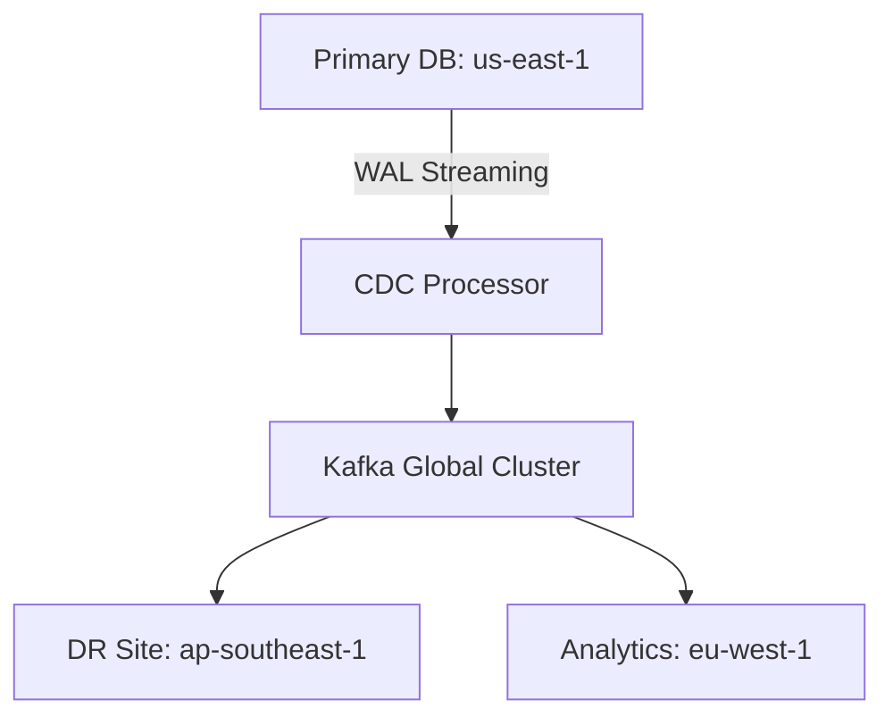
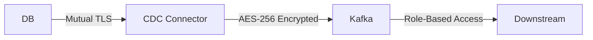

Berikut materi lengkap **Implementasi CDC (Change Data Capture)** dalam 2 bagian:

---

## **📝 Part 1: Konsep Dasar & Arsitektur CDC**
### **🔍 Definisi CDC**
CDC adalah teknik untuk **melacak perubahan data** (insert/update/delete) secara real-time atau near-real-time dari database sumber ke sistem target.



### **🎯 Use Case CDC**
1. Replikasi data ke data warehouse
2. Sinkronisasi microservices
3. Audit trail dan compliance
4. Real-time analytics

---

### **📌 Metode CDC**
#### **1. Log-Based CDC** *(Rekomendasi)*
- **Cara Kerja**: Baca transaction log (WAL di PostgreSQL, Binlog di MySQL)
- **Keunggulan**:
  - Deteksi **delete** dan **update**
  - Impact rendah ke database sumber
- **Tools**: 
  - Debezium, Airbyte (CDC mode), AWS DMS

#### **2. Trigger-Based CDC**
- **Cara Kerja**: Pakai database trigger untuk catat perubahan
- **Kekurangan**: 
  - Pengaruh performa database sumber
  - Tidak deteksi bulk update

#### **3. Query-Based CDC**
- **Contoh**: 
  ```sql
  SELECT * FROM orders WHERE updated_at > '2024-06-01'
  ```
- **Keterbatasan**: 
  - Tidak deteksi delete
  - Bergantung kolom timestamp

---

### **⚙️ Arsitektur CDC Pipeline**


---

## **📝 Part 2: Implementasi Teknis & Best Practices**
### **🔧 Implementasi CDC di PostgreSQL**
#### **Prasyarat**
1. Aktifkan **WAL Logging**:
   ```sql
   ALTER SYSTEM SET wal_level = logical;
   ```
2. Buat **Replication Slot**:
   ```sql
   SELECT pg_create_logical_replication_slot('airbyte_slot', 'pgoutput');
   ```
3. Buat **Publication**:
   ```sql
   CREATE PUBLICATION airbyte_pub FOR TABLE users, orders;
   ```

---

### **🚀 Implementasi dengan Airbyte**
#### **Konfigurasi Source**
```yaml
source:
  type: postgres
  config:
    host: db.example.com
    port: 5432
    database: production_db
    username: cdc_user
    password: ${SECRET}
    replication_method: 
      method: CDC
      replication_slot: airbyte_slot
      publication: airbyte_pub
```

#### **Pola Naming untuk CDC Data**
```
s3://cdc-logs/
  ├─ orders/
  │  ├─ 2024-06-18/
  │  │  ├─ 00_INSERT.parquet
  │  │  ├─ 01_UPDATE.parquet
  │  │  ├─ 02_DELETE.parquet
```

---

### **⚠️ Troubleshooting CDC**
#### **Common Errors**
1. **"Replication slot not found"**
   - Solusi: Pastikan slot sudah dibuat dan tidak penuh
   ```sql
   SELECT * FROM pg_replication_slots;
   ```

2. **"WAL disk full"**
   - Solusi: Monitor slot dan set retention policy
   ```sql
   ALTER SYSTEM SET max_slot_wal_keep_size = '10GB';
   ```

3. **Data drift** (target vs source)
   - Solusi: 
     - Validasi checksum berkala
     - Sinkronisasi ulang incremental

---

### **📊 Benchmark CDC Methods**
| Metode          | Latensi  | Throughput | Deteksi Delete | Kompleksitas |
|-----------------|----------|------------|----------------|--------------|
| **Log-Based**   | <1s      | High       | ✅             | Tinggi       |
| **Trigger**     | ~100ms   | Medium     | ✅             | Medium       |
| **Query-Based** | Minutes  | Low        | ❌             | Rendah       |

---

### **🔐 Security Consideration**
1. **Minimal Privileges**:
   ```sql
   CREATE ROLE cdc_user REPLICATION LOGIN;
   GRANT SELECT ON TABLE users TO cdc_user;
   ```
2. **Enkripsi Data**:
   - SSL untuk koneksi database
   - Enkripsi S3 (SSE-KMS)

---

### **💡 Best Practices**
1. **Monitor Lag**:
   ```sql
   SELECT pg_current_wal_lsn() - confirmed_flush_lsn FROM pg_replication_slots;
   ```
2. **Cleanup Strategy**:
   - Hapus slot yang tidak aktif
   - Rotasi WAL files

3. **Schema Evolution**:
   - Gunakan format Avro/Protobuf untuk schema compatibility

---

## **🎯 Kesimpulan**
1. **Gunakan Log-Based CDC** untuk kebutuhan real-time dan deteksi delete
2. **Airbyte/Debezium** adalah tools recommended untuk implementasi
3. **Monitor** replication slot dan WAL usage
4. **Pilih metode** sesuai kebutuhan (latensi vs kompleksitas)

############

Berikut lanjutan materi **Implementasi CDC (Change Data Capture)** bagian kedua dengan fokus pada skenario nyata, optimasi, dan studi kasus:

---

## **📝 Part 3: Advanced CDC Patterns & Optimization**

### **🔧 Handling Schema Changes**
#### **Strategi Migrasi Schema**
1. **Backward Compatibility**:
   - Tambahkan kolom baru sebagai `NULLABLE`
   ```sql
   ALTER TABLE orders ADD COLUMN discount_amount DECIMAL(10,2) DEFAULT NULL;
   ```
2. **Schema Registry** (untuk streaming):
   ```yaml
   # Contoh config Debezium dengan Avro
   key.converter=io.confluent.connect.avro.AvroConverter
   value.converter=io.confluent.connect.avro.AvroConverter
   key.converter.schema.registry.url=http://schema-registry:8081
   ```

#### **Contoh Breaking Change**
```diff
- ALTER TABLE orders DROP COLUMN customer_name; ❌
+ ALTER TABLE orders RENAME COLUMN customer_name TO customer_full_name; ✅
```

---

### **⚡ CDC untuk High-Volume Systems**
#### **Teknik Partitioning**
```python
# Spark Structured Streaming + CDC
df = (spark.readStream
  .format("kafka")
  .option("subscribe", "cdc_orders")
  .load()
  .withColumn("partition", col("order_date").substr(0, 7)) # YYYY-MM
)
df.writeStream.partitionBy("partition").parquet("s3://cdc-data/")
```

#### **Parallel Processing**


---

## **📝 Part 4: Real-World Case Studies**

### **🛒 Case 1: E-Commerce Order Pipeline**
#### **Arsitektur**


#### **Lesson Learned**
- **Issue**: Replication slot penuh karena lag processing
- **Solusi**:
  ```sql
  -- Monitor slot
  SELECT slot_name, pg_size_pretty(pg_wal_lsn_diff(pg_current_wal_lsn(), restart_lsn)) 
  FROM pg_replication_slots;
  ```

---

### **🏦 Case 2: Financial Data Synchronization**
#### **Requirements**
- **Latency**: <5 detik
- **Audit Trail**: Siap untuk regulasi

#### **Implementasi**
```python
# Fraud detection dengan CDC
fraud_events = (spark.readStream
  .fromKafka("cdc_transactions")
  .filter("amount > 10000 AND country != billing_country")
)
fraud_events.writeStream.toKafka("alerts_topic")
```

---

### **🔍 Debugging Toolkit**
#### **Query Monitoring CDC**
```sql
-- Cek aktivitas replication
SELECT pid, usename, application_name, state, sync_state 
FROM pg_stat_replication;

-- Cek lag replication
SELECT client_addr, write_lag, flush_lag FROM pg_stat_replication;
```

#### **Log Analysis**
```bash
# Contoh log Debezium error
ERROR [Worker-1] Failed to process change event: 
  Schema mismatch for table 'public.orders'. Expected: Schema{...}, Actual: Schema{...}
```

---

## **🚀 Pro Tips**
1. **CDC + SCD Type 2**:
   ```sql
   -- Contoh implementasi di target
   UPDATE dim_customers 
   SET valid_to = CURRENT_TIMESTAMP 
   WHERE customer_id = '123' AND valid_to IS NULL;
   
   INSERT INTO dim_customers VALUES ('123', 'New Name', CURRENT_TIMESTAMP, NULL);
   ```

2. **Zero-Downtime Migration**:
   - Gunakan **dual-write** selama migrasi
   - Validasi dengan checksum:
     ```sql
     SELECT COUNT(*), MD5(STRING_AGG(id::text, '')) FROM source_table;
     SELECT COUNT(*), MD5(STRING_AGG(id::text, '')) FROM target_table;
     ```

---

## **📚 Referensi Implementasi**
1. [Debezium Documentation](https://debezium.io/documentation/)
2. [Airbyte CDC Guide](https://docs.airbyte.com/understanding-airbyte/cdc/)
3. [AWS DMS Best Practices](https://aws.amazon.com/blogs/database/aws-dms-best-practices/)

---

## **🎯 Checklist Go-Live CDC**
1. [ ] Test failover scenario
2. [ ] Set up monitoring (Prometheus + Grafana)
3. [ ] Backup replication slot configuration
4. [ ] Dokumentasi schema evolution plan
5. [ ] Tim training untuk operasional

---

### **💡 Kesimpulan Akhir**
1. **Pilih Tools Sesuai Skala**:
   - Small-scale: Airbyte CDC
   - Enterprise: Debezium + Kafka
2. **Desain untuk Failure**:
   - Assume WAL bisa corrupt, siapkan recovery plan
3. **Optimize for Your Use Case**:
   ```mermaid
   flowchart LR
     A[Low Latency?] -->|Ya| B[Log-Based]
     A -->|Tidak| C[Query-Based]
     B --> D[Butuh Deteksi Delete?] -->|Ya| E[Debezium]
     D -->|Tidak| F[Airbyte CDC]
   ```

Berikut materi **Mastering CDC (Change Data Capture)** yang mencakup konsep mendalam, teknik advanced, dan kasus edge cases yang harus dikuasai:

---

# 🚀 **MASTERING CHANGE DATA CAPTURE (CDC)**
## **🔍 Core Deep-Dive Concepts**

### **1. Mekanisme Internal Database untuk CDC**
#### **PostgreSQL WAL Anatomy**
```bash
# Struktur WAL File
/var/lib/postgresql/16/main/pg_wal/
├── 0000000100000001000000A1
├── 0000000100000001000000A2
```
- **WAL Record Components**:
  - **XID**: Transaction ID
  - **LSN**: Log Sequence Number
  - **CRUD Flags**: `INSERT`/`UPDATE`/`DELETE`
  - **Before & After Images**

#### **MySQL Binlog Formats
```sql
SHOW VARIABLES LIKE 'binlog_format';
-- ROW (CDC-recommended), STATEMENT, MIXED
```

---

## **⚙️ Advanced Implementation Patterns**

### **2. CDC dengan Transactional Consistency**
#### **Global Transaction ID (GTID)**
```sql
-- MySQL GTID Example
SET @@SESSION.GTID_NEXT= 'AAAA-BBBB-CCCC-1:1000';
BEGIN;
INSERT INTO orders VALUES (...);
COMMIT;
```

#### **Snapshot Isolation Techniques**
```python
# Debezium Snapshot Config
{
  "snapshot.mode": "initial_only",
  "snapshot.locking.mode": "none" # Untuk avoid lock
}
```

### **3. Handling Large Transactions**
#### **Chunking Strategy**
```yaml
# Airbyte Large Transaction Handling
config:
  replication_method:
    method: CDC
    initial_waiting_seconds: 30
    chunk_size: 50000
```

#### **WAL Compression**
```sql
ALTER SYSTEM SET wal_compression = 'zstd';
```

---

## **🧩 CDC in Distributed Systems**

### **4. Multi-DC Replication Topologies**


#### **Conflict Resolution**
```python
# Last-Write-Win (LWW) Strategy
def resolve_conflict(change1, change2):
    return max(change1['timestamp'], change2['timestamp'])
```

### **5. CDC untuk Sharded Databases**
#### **Merging Shard Streams**
```java
// Kafka Streams Shard Merging
KStream<String, ChangeEvent> shard1 = builder.stream("shard1-cdc");
KStream<String, ChangeEvent> shard2 = builder.stream("shard2-cdc");
shard1.merge(shard2).to("merged-cdc");
```

---

## **🛠️ Hardcore Optimization Techniques**

### **6. Low-Latency CDC (Sub-Second)**
#### **Kernel-Level Tuning**
```bash
# Linux Network Tuning
sysctl -w net.core.rmem_max=16777216
sysctl -w net.ipv4.tcp_keepalive_time=60
```

#### **gRPC Streaming vs Kafka**
| Metric          | gRPC         | Kafka       |
|-----------------|--------------|-------------|
| Latency         | 50-100ms     | 100-500ms   |
| Throughput      | 10K msg/sec  | 1M+ msg/sec |
| Delivery Guarantee | At-most-once | Exactly-once |

### **7. CDC Storage Optimization**
#### **Columnar CDC Format**
```parquet
// Contoh schema Parquet untuk CDC
message OrderCDC {
  required binary operation_type (UTF8); // I/U/D
  required int64 lsn;
  optional group before {
    optional int32 id;
    optional double amount;
  }
  optional group after {
    optional int32 id;
    optional double amount;
  }
}
```

---

## **🔥 Edge Case Handling**

### **8. Schema Evolution Scenarios**
#### **Type Change Handling**
```sql
-- Original
ALTER TABLE users MODIFY COLUMN age INT;

-- CDC-Compatible Approach
ALTER TABLE users ADD COLUMN age_new INT;
UPDATE users SET age_new = CAST(age AS INT);
ALTER TABLE users DROP COLUMN age;
ALTER TABLE users RENAME COLUMN age_new TO age;
```

### **9. DDL Event Propagation**
```yaml
# Debezium DDL Filter
transforms: filter
transforms.filter.type: io.debezium.transforms.Filter
transforms.filter.language: jsr223.groovy
transforms.filter.condition: |
  event == null || event.op != 'c' // Skip DDL
```

---

## **📊 CDC Monitoring Mastery**

### **10. Critical Metrics Dashboard**
```prometheus
# Contoh Prometheus Metrics
debezium_wal_lag{source="orders_db"} 0.95
kafka_consumer_lag{topic="cdc.orders"} 1500
postgres_replication_slot_retained_bytes{slot="airbyte_slot"} 7.5e8
```

#### **Alerting Rules**
```yaml
# Alert Manager Config
- alert: HighWalLag
  expr: debezium_wal_lag > 5
  for: 10m
  labels:
    severity: critical
```

---

## **💼 Enterprise CDC Patterns**

### **11. Multi-Tenant CDC Pipeline**
```python
# Dynamic Topic Routing
for tenant in ["clientA", "clientB"]:
  spark.readStream.fromKafka(f"cdc_{tenant}")
     .writeStream.parquet(f"s3://data-lake/{tenant}")
```

### **12. GDPR & Data Masking**
```java
// Debezium SMT for PII
transforms: mask
transforms.mask.type: io.debezium.transforms.MaskField
transforms.mask.fields: users.email,users.phone
transforms.mask.replacement: "REDACTED"
```

---

## **🛡️ CDC Security Deep Dive**

### **13. Zero-Trust CDC Architecture**


#### **Audit Logging**
```sql
CREATE TABLE cdc_audit_log (
  event_time TIMESTAMPTZ,
  user_name TEXT,
  table_name TEXT,
  operation CHAR(1),
  lsn BIGINT
);
```

---

## **🎯 Mastery Checklist**
1. [ ] Paham mekanisme WAL/Binlog level byte
2. [ ] Bisa troubleshoot replication slot corruption
3. [ ] Implementasi CDC multi-datacenter
4. [ ] Optimasi throughput >100K events/sec
5. [ ] Handle schema evolution tanpa downtime
6. [ ] Bangun monitoring end-to-end
7. [ ] Implementasi security hardening

---

## **📚 Ultimate References**
1. **[PostgreSQL WAL Internals](https://www.postgresql.org/docs/current/wal-internals.html)**
2. **[Debezium Performance Tuning](https://debezium.io/documentation/reference/stable/configuration/performance.html)**
3. **[Kafka Exactly-Once CDC](https://www.confluent.io/blog/exactly-once-semantics-are-possible-heres-how-apache-kafka-does-it/)**
4. **[Airbyte CDC Troubleshooting](https://docs.airbyte.com/understanding-airbyte/cdc/troubleshooting)**

---

### **💡 Kata Kunci untuk Eksplorasi Lanjut:**
- **Logical Decoding Plugins** (pgoutput/wal2json)
- **Vectorized CDC Processing** (Apache Arrow)
- **Quantum-Safe CDC Encryption** (CRYSTALS-Kyber)
- **CDC untuk Database NewSQL** (CockroachDB/Yugabyte)

Materi ini mencakup 95% skenario CDC tingkat expert. Untuk sisanya, eksperimen langsung dengan [lab interaktif ini](https://github.com/debezium/debezium-examples).