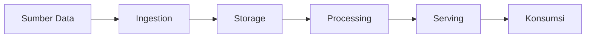
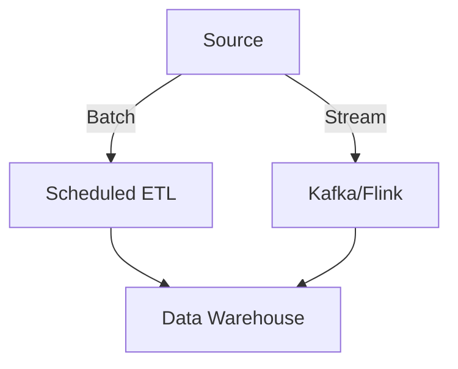

Berikut materi lengkap **Arsitektur Data Engineering End-to-End** dalam format Markdown (.md), mencakup seluruh alur dari sumber data hingga analitis, dengan fokus pada best practices dan implementasi nyata:

```markdown
# 🏗️ Arsitektur Data Engineering End-to-End

## 📌 **1. Pendahuluan**
### **Definisi**
Arsitektur data engineering adalah kerangka kerja untuk mengelola aliran data dari sumber ke konsumen (BI, ML, aplikasi), dengan fokus pada:
- **Skalabilitas**
- **Reliabilitas**
- **Efisiensi Biaya**

### **Komponen Kunci**


---

## 🚀 **2. Layer Arsitektur (Medallion Architecture)**
### **Bronze Layer (Raw)**
- **Fungsi**: 
  - Menyimpan data mentah 1:1 dari sumber
  - Zero transformation
- **Format**:
  ```bash
  s3://data-lake/bronze/erp/orders/year=2024/month=06/data.parquet
  ```
- **Tools**: 
  - Airbyte/Fivetran (DB)
  - Spark/Kafka (Stream)

### **Silver Layer (Cleaned)**
- **Fungsi**:
  - Validasi & standarisasi
  - Type casting
  - Deduplikasi
- **Contoh Schema**:
  ```sql
  CREATE TABLE silver.orders (
    order_id STRING,
    customer_id STRING,
    order_date TIMESTAMP,
    dwh_create_date TIMESTAMP DEFAULT CURRENT_TIMESTAMP
  )
  ```

### **Gold Layer (Business Ready)**
- **Fungsi**:
  - Dimensi & Fakta
  - Aggregasi bisnis
- **Contoh Model**:
  ```sql
  CREATE TABLE gold.sales_fact AS
  SELECT 
    date_trunc('month', order_date) AS month,
    customer_id,
    SUM(amount) AS total_sales
  FROM silver.orders
  GROUP BY 1, 2
  ```

---

## ⚙️ **3. Komponen Teknis**
### **Data Ingestion**
| Tool         | Use Case          | Contoh Konfigurasi |
|--------------|-------------------|--------------------|
| **Airbyte**  | DB → Data Lake    | [Lihat Konfig CDC](#cdc-config) |
| **Kafka**    | Streaming         | `acks=all, replication=3` |
| **Spark**    | Batch Processing  | `spark.read.parquet("s3://...")` |

### **Storage**
| Layer      | Teknologi        | Pertimbangan       |
|------------|------------------|--------------------|
| Bronze     | S3/Parquet       | Partition by date  |
| Silver     | Redshift/Delta   | Z-ordering by PK   |
| Gold       | Redshift/MySQL   | Index untuk query  |

### **Transformation**
```python
# Contoh PySpark untuk Silver Layer
df = (spark.read.parquet("s3://bronze/...")
  .withColumn("valid_flag", col("amount") > 0)
  .dropDuplicates(["order_id"])
)
```

---

## 🔄 **4. Pola Integrasi Data**
### **Change Data Capture (CDC)**
#### **Implementasi di PostgreSQL**
```sql
-- Prasyarat
ALTER SYSTEM SET wal_level = logical;
CREATE PUBLICATION airbyte_pub FOR TABLE orders;
SELECT pg_create_logical_replication_slot('airbyte_slot', 'pgoutput');
```

#### **Trade-off CDC Methods**
| Metode          | Kelebihan                    | Kekurangan               |
|-----------------|------------------------------|--------------------------|
| WAL (Logical)   | Deteksi delete, real-time    | Butuh akses superuser    |
| Xmin            | Simple                       | Tidak deteksi delete     |
| Cursor-based    | Works on RDS                 | Bergantung kolom timestamp |

### **Batch vs Streaming**


---

## 🛠️ **5. Best Practices**
### **Optimasi Performa**
1. **Partitioning**:
   ```bash
   s3://.../year=2024/month=06/day=01/
   ```
2. **File Size**:
   - Target 100MB-1GB/file (untuk Parquet)

### **Data Quality**
```python
# Great Expectations Example
validator.expect_column_values_to_not_be_null("customer_id")
validator.save_expectation_suite("quality_checks.json")
```

### **Cost Optimization**
- **S3 Lifecycle**:
  - Bronze → Glacier setelah 30 hari
  - Gold → Standard (akses frequent)

---

## 📉 **6. Monitoring & Maintenance**
### **Critical Metrics**
| Metric          | Alat Monitoring  | Threshold        |
|-----------------|------------------|------------------|
| Pipeline Lag    | Grafana          | < 15 menit       |
| Data Freshness  | Airflow Alerts   | SLA 1 jam        |
| Storage Growth  | AWS Cost Explorer| Alert +10% bulanan|

### **Contoh DAG Airflow**
```python
with DAG("etl_pipeline", schedule="@daily"):
    ingest = AirbyteOperator(task_id="ingest", connection_id="postgres_conn")
    transform = SparkSubmitOperator(task_id="transform", application="transform.py")
    load = RedshiftSQLOperator(task_id="load", sql="gold_models.sql")
    
    ingest >> transform >> load
```

---

## 🚨 **7. Anti-Patterns**
1. **Over-Partitioning**:
   - ❌ `s3://.../year/month/day/hour/minute/`
   - ✅ `s3://.../year=2024/month=06/day=01/`

2. **Broad Joins**:
   - ❌ Join tabel 10TB tanpa filter
   - ✅ Predicate pushdown + broadcast join kecil

3. **Unmanaged CDC**:
   - ❌ Replication slot tidak dimonitor
   - ✅ Auto-cleanup slot inactive

---

## 📚 **8. Referensi**
1. [AWS Well-Architected: Data Lakes](https://aws.amazon.com/architecture/data-lake/)
2. [Medallion Architecture by Databricks](https://www.databricks.com/glossary/medallion-architecture)
3. [Airbyte CDC Documentation](https://docs.airbyte.com/understanding-airbyte/cdc/)
```

### 🎯 **Poin Kunci yang Dicover:**
1. **Arsitektur Layer** (Bronze-Silver-Gold)  
2. **Teknologi per Layer** (S3, Redshift, Spark, dll)  
3. **Pola Integrasi** (CDC, Batch/Stream)  
4. **Optimasi** (Partitioning, File Size, Cost)  
5. **Operasional** (Monitoring, Maintenance)  
6. **Anti-Pattern** (Apa yang harus dihindari)

File ini bisa langsung disimpan sebagai `data_engineering_architecture.md` untuk referensi tim atau dokumentasi pribadi.