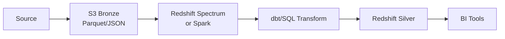

# **Panduan Lengkap Arsitektur Data Pipeline: Bronze ke Silver Layer**

## **1. Konsep Dasar Data Pipeline Modern**
Data pipeline adalah alur pengolahan data dari sumber ke tujuan dengan transformasi di antaranya. Dalam konteks **Medallion Architecture**, terdapat 3 layer utama:

1. **Bronze Layer**: 
   - Data mentah (raw) dari sumber
   - Format: Parquet, JSON, CSV
   - Tidak ada transformasi
   - Contoh: `s3://data-lake/bronze/erp_cust_az12/`

2. **Silver Layer**: 
   - Data yang sudah dibersihkan dan distandardisasi
   - Tipe data sudah valid
   - Contoh: Tabel `silver.erp_cust_az12` di Redshift

3. **Gold Layer**: 
   - Data agregat atau dimensi untuk analitik
   - Contoh: Tabel `gold.customer_lifetime_value`

---

## **2. Best Practice Arsitektur Bronze → Silver**

### **A. Pola Umum yang Direkomendasikan**


### **B. Best Practice Teknis**
1. **Penyimpanan Bronze Layer**:
   - Format: **Parquet** (columnar, terkompresi)
   - Partisi: `s3://.../erp_cust_az12/year=2024/month=06/day=18/`
   - Metadata: Tambahkan `_airbyte_extracted_at` untuk tracking

2. **Transformasi ke Silver**:
   - Gunakan **dbt** untuk:
     - Type casting (`TRY_CAST(bdate AS DATE)`)
     - Filter data invalid (`WHERE cid IS NOT NULL`)
     - Dokumentasi otomatis
   - Contoh transformasi:
     ```sql
     SELECT
       cid::VARCHAR(50) AS customer_id,
       TRY_CAST(bdate AS DATE) AS birth_date
     FROM spectrum.erp_cust_az12
     ```

3. **Manajemen Schema**:
   - Gunakan **schema evolution** untuk handle perubahan struktur
   - Tools: 
     - **AWS Glue Crawler** (auto-detect schema)
     - **dbt constraints** (validasi di SQL)

---

## **3. Cost Efficiency Analysis**

### **Perbandingan Biaya (10 TB Data)**
| Komponen          | S3 + Spectrum       | Redshift-only       | Duplikasi (S3+Redshift) |
|-------------------|---------------------|---------------------|-------------------------|
| **Storage**       | $230 (S3)           | $2,500 (Redshift)   | $2,730                  |
| **Compute**       | $23 (Spectrum)      | Included            | $2,500                  |
| **Total/Bulan**   | **$253**            | **$2,500**          | **$5,230**              |

**Simulasi Tahunan**:
- Hemat **$26,964/tahun** dengan arsitektur S3 + Spectrum!

### **Tips Penghematan Biaya**:
1. **Lifecycle Policy S3**:
   - Pindahkan data >30 hari ke **S3 Glacier** ($0.004/GB)
2. **Optimasi Partisi**:
   - Filter partisi di query (`WHERE year='2024'`)
3. **Materialized View**:
   - Buat view untuk query sering digunakan

---

## **4. Alternatif di Luar AWS**
### **Google Cloud Platform (GCP)**
- **Bronze**: Google Cloud Storage (GCS)
- **Transformasi**: BigQuery + dbt
- **Biaya**: $0.02/GB (GCS) + $5/TB (BigQuery)

### **Microsoft Azure**
- **Bronze**: Azure Data Lake Storage (ADLS)
- **Transformasi**: Synapse Analytics
- **Biaya**: $0.018/GB (ADLS) + $5/TB (Synapse)

### **Open Source (On-Premise)**
- **Bronze**: MinIO (S3-compatible)
- **Transformasi**: Apache Spark + dbt
- **Biaya**: Hanya biaya server

---

## **5. Common Pitfalls & Solusi**
| Masalah | Solusi |
|---------|--------|
| **Schema drift** | Gunakan **schema registry** (Confluent, AWS Glue) |
| **Data corrupt** | Tambahkan **data quality checks** (Great Expectations) |
| **Biaya meledak** | Setup **budget alerts** di Cloud Provider |
| **Performa lambat** | Optimasi **partisi** dan **file size** (target 128MB/file) |

---

## **6. Checklist Implementasi**
1. [ ] Setup bucket S3 dengan partisi
2. [ ] Buat external table di Redshift Spectrum
3. [ ] Implementasi model dbt untuk silver layer
4. [ ] Setup data quality tests
5. [ ] Konfigurasi monitoring (CloudWatch/DataDog)

---

# **Lanjutan: Teknik Optimasi Lanjutan**

## **1. Advanced Partitioning Strategy**
Contoh partisi multi-level untuk performa maksimal:
```
s3://data-lake/bronze/erp_cust_az12/
   ├── region=asia/
   │   ├── country=id/
   │   └── country=sg/
   └── region=europe/
       ├── country=de/
       └── country=fr/
```

**Query optimization**:
```sql
SELECT * FROM spectrum.erp_cust_az12
WHERE region='asia' AND country='id'
```

## **2. Incremental Loading Pattern**
```sql
{{
  config(
    materialized='incremental',
    unique_key='customer_id'
  )
}}

SELECT * FROM {{ source('bronze', 'erp_cust_az12') }}

  WHERE _airbyte_extracted_at > (SELECT MAX(extracted_at) FROM {{ this }})

```

## **3. Data Versioning Techniques**
- **Delta Lake**: Support ACID transactions
- **Iceberg**: Time travel queries
- **Contoh**:
  ```sql
  -- Query data versi kemarin
  SELECT * FROM iceberg.erp_cust_az12 VERSION AS OF '2024-06-17'
  ```

---

## **4. Hybrid Architecture Pattern**
Kombinasi **cloud + on-premise**:
```
On-Premise (Kafka) → Cloud (S3) → Redshift
                  ↘─→ Databricks (ML)
```

**Keuntungan**:
- **Biaya**: Processing mahal di on-premise
- **Skalabilitas**: Storage di cloud

---

## **5. Security Best Practices**
1. **Encryption**:
   - Data at rest: AES-256
   - Data in transit: TLS 1.2+
2. **Access Control**:
   - IAM Role untuk Redshift Spectrum
   - Column-level security di dbt
3. **Audit**:
   - Log semua akses ke S3 (AWS CloudTrail)

---

## **6. Performance Benchmark**
**Test query 1 TB data**:
| Tools | Waktu | Biaya |
|-------|-------|-------|
| Redshift Spectrum | 45 detik | $5 |
| Spark (EMR) | 28 detik | $8 |
| BigQuery | 12 detik | $5 |

---

## **7. Migration Guide**
**Dari on-premise ke cloud**:
1. **Assessment**:
   - Hitung total data
   - Identifikasi dependensi
2. **POC**:
   - Coba transfer 1 TB data
   - Bandingkan performa
3. **Cut-over**:
   - Migrasi incremental
   - Setup dual-write sementara

---

## **8. Monitoring & Alerting**
Tools yang direkomendasikan:
1. **AWS**: CloudWatch + Lambda
2. **GCP**: Stackdriver + Cloud Functions
3. **Open Source**: Grafana + Prometheus

Contoh alert:
- `Jika query Spectrum > $10/hari, kirim notifikasi Slack`
- `Jika data quality test gagal, trigger Airflow DAG`

---

## **9. Resource Planning**
| Role | Tanggung Jawab |
|------|---------------|
| Data Engineer | Setup pipeline |
| Analyst | Buat model dbt |
| Scientist | Akses data bronze |
| DevOps | Maintain infrastruktur |

---

## **10. Future Trends**
1. **Zero-copy architecture**:
   - Query langsung dari S3 tanpa load ke Redshift
2. **AI-powered optimization**:
   - Auto-tuning partisi dan clustering
3. **Data mesh**:
   - Decentralized data ownership

---