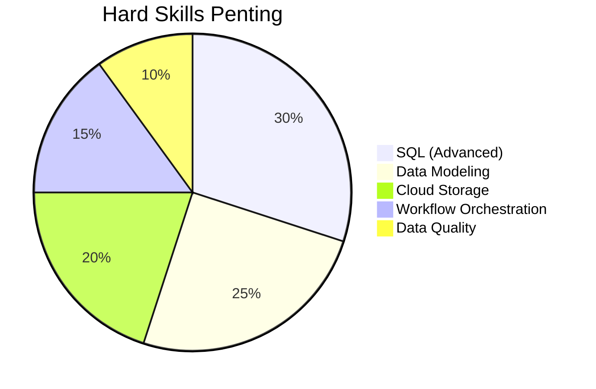
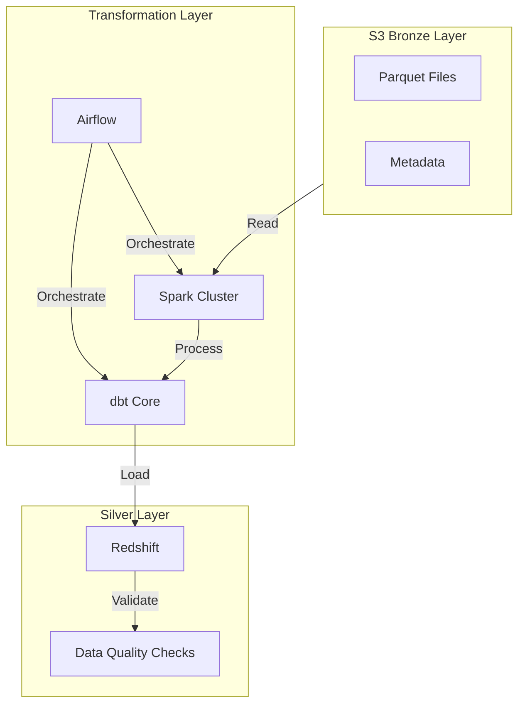
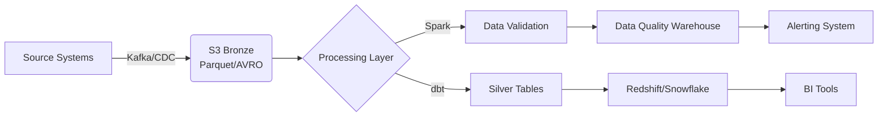
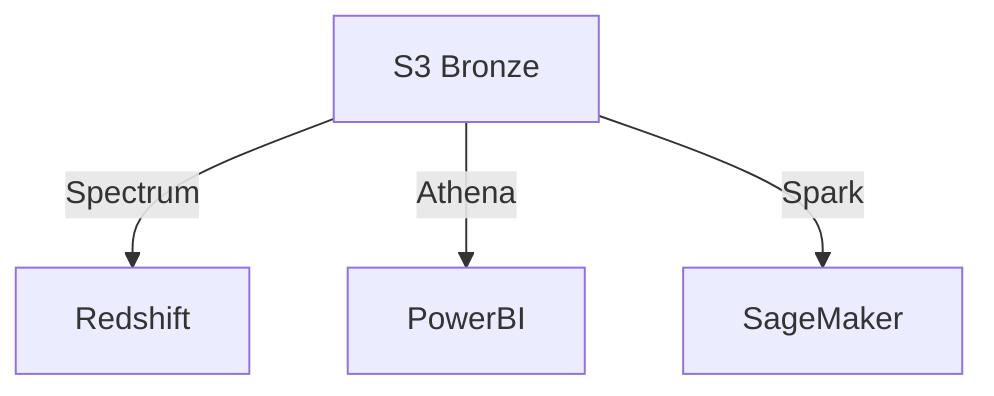
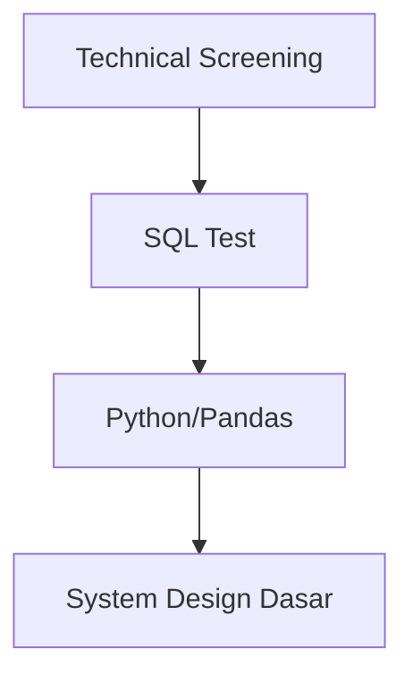
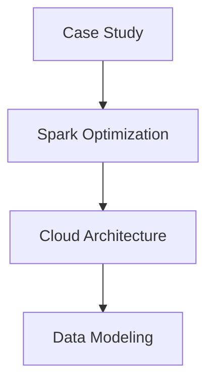
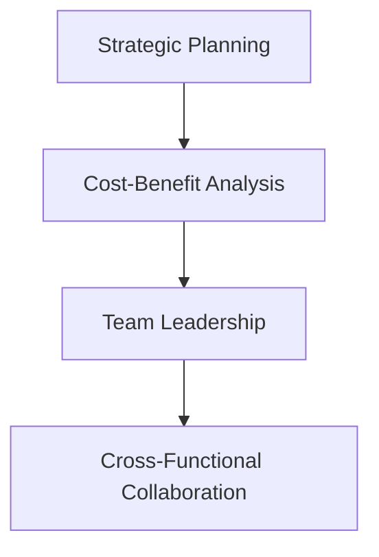
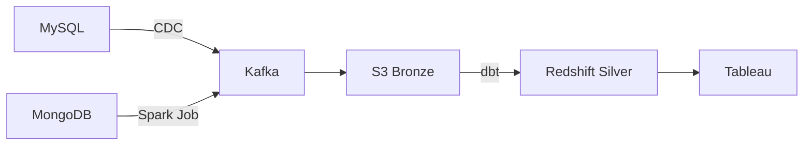
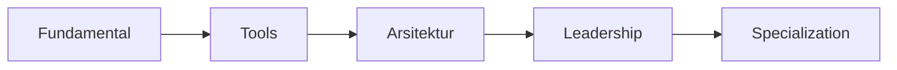

# **Panduan Fundamental & Skill Teknis Data Pipeline: Bronze ke Silver Layer**

## **1. Fundamental Skill yang Harus Dikuasai**

### **A. Hard Skills Wajib**


#### **1. SQL Level Expert**
- **Fungsi Penting**:
  ```sql
  -- Contoh query advanced
  WITH customer_stats AS (
    SELECT 
      cid,
      TRY_CAST(bdate AS DATE) AS birth_date,
      DATEDIFF(year, TRY_CAST(bdate AS DATE), CURRENT_DATE) AS age
    FROM spectrum.erp_cust_az12
    WHERE bdate IS NOT NULL
  )
  SELECT 
    FLOOR(age/10)*10 AS age_group,
    COUNT(*) AS count
  FROM customer_stats
  GROUP BY 1
  ```

#### **2. Data Modeling**
- **Teknik Penting**:
  - Star Schema vs Snowflake
  - Slowly Changing Dimension (SCD Type 2)
  - Partitioning Strategy

#### **3. Cloud Storage Optimization**
- **Pattern Efisien**:
  ```bash
  s3://your-bucket/
    └── bronze/
        └── erp/
            ├── cust_az12/
            │   ├── year=2024/
            │   │   ├── month=01/
            │   │   └── month=02/
            └── loc_a101/
                ├── country=US/
                └── country=ID/
  ```

---

## **2. Arsitektur Teknis Detail**

### **A. Diagram Arsitektur Modern**


### **B. Komponen Kritis & Tools
| Komponen | Tools Populer | Keterangan |
|----------|--------------|------------|
| **Storage** | S3, GCS, ADLS | Pilih format Parquet/ORC |
| **Processing** | Spark, dbt, Flink | Spark untuk data besar |
| **Orchestration** | Airflow, Dagster | Schedule & monitoring |
| **Quality** | Great Expectations | Validasi schema & data |

---

## **3. Implementasi Teknis Step-by-Step**

### **A. Setup Infrastructure (AWS Example)**
1. **S3 Bucket Policy**:
   ```json
   {
       "Version": "2012-10-17",
       "Statement": [
           {
               "Effect": "Allow",
               "Principal": {
                   "AWS": "arn:aws:iam::123456789012:role/RedshiftSpectrumRole"
               },
               "Action": "s3:GetObject",
               "Resource": "arn:aws:s3:::your-data-lake/bronze/*"
           }
       ]
   }
   ```

2. **Redshift Spectrum Setup**:
   ```sql
   CREATE EXTERNAL SCHEMA spectrum
   FROM DATA CATALOG 
   DATABASE 'spectrum_db'
   IAM_ROLE 'arn:aws:iam::123456789012:role/RedshiftS3AccessRole'
   CREATE EXTERNAL DATABASE IF NOT EXISTS;
   ```

### **B. dbt Core Implementation**
1. **Staging Model**:
   ```sql
   -- models/staging/erp_cust_az12.sql
   {{
     config(
       materialized='view'
     )
   }}
   SELECT
     cid,
     bdate,
     gen,
     _airbyte_extracted_at AS extracted_at
   FROM spectrum.erp_cust_az12
   WHERE DATE(_airbyte_extracted_at) = CURRENT_DATE
   ```

2. **Silver Model**:
   ```sql
   -- models/silver/erp_cust_az12.sql
   {{
     config(
       materialized='table',
       dist='cid',
       sort='birth_date'
     )
   }}
   SELECT
     cid::VARCHAR(50) AS customer_id,
     TRY_CAST(bdate AS DATE) AS birth_date,
     CASE 
       WHEN gen = 'M' THEN 'Male'
       WHEN gen = 'F' THEN 'Female'
       ELSE 'Unknown'
     END AS gender,
     CURRENT_TIMESTAMP AS dwh_loaded_at
   FROM {{ ref('stg_erp_cust_az12') }}
   ```

### **C. Data Quality Framework**
```python
# tests/data_quality/erp_cust_az12.py
import great_expectations as ge

def test_customer_data():
    df = ge.read_parquet("s3://your-data-lake/silver/erp_cust_az12/")
    
    # Expectasi data
    df.expect_column_values_to_not_be_null("customer_id")
    df.expect_column_values_to_be_between(
        "birth_date", 
        min_value="1950-01-01",
        max_value=datetime.now().strftime("%Y-%m-%d")
    )
```

---

## **4. Performance Optimization**

### **A. Teknik Query Tuning**
1. **Predicate Pushdown**:
   ```sql
   -- Buruk
   SELECT * FROM silver.erp_cust_az12
   WHERE DATE(birth_date) > '2020-01-01'

   -- Baik
   SELECT * FROM silver.erp_cust_az12
   WHERE birth_date > CAST('2020-01-01' AS DATE)
   ```

2. **Partition Pruning**:
   ```sql
   -- Partisi tidak optimal
   SELECT * FROM spectrum.erp_cust_az12
   WHERE bdate BETWEEN '2024-01-01' AND '2024-01-31'

   -- Partisi optimal
   SELECT * FROM spectrum.erp_cust_az12
   WHERE year = 2024 AND month = 1
   ```

### **B. File Size Optimization**
| Metric | Rekomendasi | Alasan |
|--------|-------------|--------|
| **File Size** | 128MB - 1GB | Optimal untuk Parquet |
| **Row Group Size** | 10-100MB | Balance read efficiency |
| **Compression** | SNAPPY | Speed vs ratio balance |

---

## **5. Error Handling & Recovery**

### **A. Pola Retry yang Efektif**
```python
# airflow/dags/erp_pipeline.py
from airflow.operators.bash import BashOperator
from airflow.decorators import task

@task(retries=3, retry_delay=60)
def transform_erp_data():
    dbt_run = BashOperator(
        task_id='dbt_run',
        bash_command='dbt run --select silver.erp_cust_az12',
        retry_exponential_backoff=True
    )
```

### **B. Data Recovery Procedure**
1. **Identifikasi corrupt data**:
   ```sql
   -- Cari baris dengan data invalid
   SELECT * FROM silver.erp_cust_az12
   WHERE TRY_CAST(customer_id AS INT) IS NULL
   ```

2. **Reprocessing**:
   ```bash
   # Re-run untuk tanggal tertentu
   dbt run --select silver.erp_cust_az12 \
     --vars '{backfill_date: 2024-06-01}'
   ```

---

## **6. Advanced Monitoring**

### **A. Key Metrics to Track**
| Metric | Alat Monitoring | Threshold |
|--------|----------------|-----------|
| **Data Freshness** | Grafana | < 1 jam delay |
| **Row Count** | Datadog | ±10% dari hari sebelumnya |
| **Null Rate** | Great Expectations | < 5% per kolom |

### **B. Contoh Dashboard**
```json
{
  "panels": [
    {
      "title": "Data Latency",
      "query": "SELECT MAX(extracted_at) FROM silver.erp_cust_az12"
    },
    {
      "title": "Daily Volume",
      "query": "SELECT COUNT(*) FROM silver.erp_cust_az12 WHERE dwh_loaded_at::DATE = CURRENT_DATE"
    }
  ]
}
```

---

## **7. Skill Tambahan yang Direkomendasikan**

### **A. DevOps for Data Engineers**
1. **Infrastructure as Code**:
   ```terraform
   # Terraform: Setup S3 bucket
   resource "aws_s3_bucket" "bronze" {
     bucket = "erp-bronze-layer"
     acl    = "private"
   }
   ```

2. **CI/CD Pipeline**:
   ```yaml
   # .github/workflows/dbt.yml
   jobs:
     test:
       steps:
         - run: dbt test
     deploy:
       needs: test
       steps:
         - run: dbt run --target prod
   ```

### **B. Machine Learning Integration**
```python
# Contoh feature engineering untuk ML
df = spark.read.parquet("s3://bronze/erp_cust_az12")
features = df.withColumn("age", 
    F.datediff(F.current_date(), F.col("bdate"))/365
)
```

---

## **8. Checklist Evaluasi Arsitektur**

1. [ ] **Scalability**:
   - Handle 10x data volume tanpa redesign
2. [ ] **Cost Efficiency**:
   - < $100/TB/bulan untuk storage+processing
3. [ ] **Reliability**:
   - SLA 99.9% data tersedia sebelum jam 9 pagi
4. [ ] **Maintainability**:
   - Dokumentasi schema & lineage lengkap

---
# **Masterclass Data Pipeline: Bronze to Silver Layer (Final Edition)**

## **1. Arsitektur Enterprise-Grade yang Terbukti**

### **A. Reference Architecture Diagram**


### **B. Komponen Kritis Enterprise**
1. **Metadata Management**:
   - OpenMetadata/DataHub untuk data lineage
   - Contoh integrasi:
     ```python
     from datahub.emitter.mce_builder import make_dataset_urn
     from datahub.emitter.rest_emitter import DatahubRestEmitter

     emitter = DatahubRestEmitter(gms_server="http://datahub:8080")
     urn = make_dataset_urn("redshift", "silver.erp_cust_az12")
     emitter.emit_mce(...)
     ```

2. **Observability Stack**:
   - Grafana + Prometheus untuk monitoring:
     ```yaml
     # prometheus.yml
     scrape_configs:
       - job_name: 'dbt'
         metrics_path: '/metrics'
         static_configs:
           - targets: ['dbt-server:8080']
     ```

## **2. Implementasi End-to-End dengan Contoh Nyata**

### **A. Scenario: ERP Customer Data Pipeline**
**Input Data**:
```json
{
  "_airbyte_raw_id": "abc123",
  "_airbyte_extracted_at": "2024-06-18T12:00:00Z",
  "cid": "CUST001",
  "gen": "M",
  "bdate": "1990-05-15"
}
```

**Workflow Lengkap**:

1. **Ingestion with Airbyte**:
   ```yaml
   # airbyte_config.yaml
   sources:
     - name: erp_mysql
       source_def:
         host: erp-db.prod
         database: erp
         tables: ["customers"]
   destinations:
     - name: s3_bronze
       destination_def:
         bucket: "erp-bronze"
         format:
           parquet:
             compression: ZSTD
   ```

2. **Spark Data Validation**:
   ```python
   from pyspark.sql import functions as F
   df = spark.read.parquet("s3a://erp-bronze/erp_cust_az12/")
   valid_df = df.filter(
       F.col("cid").isNotNull() & 
       F.to_date("bdate", "yyyy-MM-dd").isNotNull()
   )
   ```

3. **dbt Transformation**:
   ```sql
   -- models/silver/erp_customers.sql
   {{
     config(
       materialized='table',
       partition_by=['date_trunc("month", birth_date)'],
       cluster_by=['gender']
     )
   }}
   SELECT
     cid AS customer_id,
     TRY_CAST(bdate AS DATE) AS birth_date,
     CASE gen
       WHEN 'M' THEN 'Male'
       WHEN 'F' THEN 'Female'
       ELSE 'Other'
     END AS gender
   FROM {{ source('bronze', 'erp_cust_az12') }}
   ```

### **B. Data Contract Implementation**
**Contoh Kontrak Data**:
```yaml
# contracts/erp_cust_az12.yaml
schema:
  fields:
    - name: customer_id
      type: string
      constraints:
        - not_null
        - max_length: 50
    - name: birth_date
      type: date
      constraints:
        - min: '1900-01-01'
quality:
  freshness: 24h
  row_count:
    warning: ±15% from 7d avg
```

## **3. Advanced Optimization Techniques**

### **A. Zero-Copy Architecture**


**Keuntungan**:
- Eliminasi duplikasi data
- Query langsung dari S3 ke BI tools

### **B. Materialized View Strategy**
```sql
-- Refresh otomatis tiap jam
CREATE MATERIALIZED VIEW silver.customer_current 
AUTO REFRESH YES
AS
SELECT * FROM silver.erp_cust_az12
WHERE is_active = TRUE;
```

## **4. Disaster Recovery Plan**

### **A. Backup Strategy**
| Layer | Method | Retention |
|-------|--------|-----------|
| Bronze | S3 Versioning + Cross-Region | 7 tahun |
| Silver | Redshift Snapshot | 35 hari |
| Gold | Snowflake Time Travel | 90 hari |

### **B. Recovery Procedure**
1. **Identifikasi Korupsi Data**:
   ```sql
   -- Cari data yang tidak sesuai kontrak
   SELECT * FROM silver.erp_cust_az12
   WHERE customer_id NOT REGEXP '^CUST[0-9]{4}$'
   ```

2. **Rollback Prosedur**:
   ```bash
   # Restore dari snapshot terakhir
   aws redshift restore-table-from-snapshot \
     --cluster-identifier prod \
     --snapshot-identifier rs:prod-2024-06-18-00-00 \
     --source-database-name silver \
     --target-database-name silver_recovered
   ```

## **5. Cost Management Framework**

### **A. Cost Allocation Tags**
```terraform
resource "aws_cost_allocation_tag" "erp_project" {
  tag_key = "Project"
  tag_values = ["ERP_Modernization"]
}
```

### **B. Budget Alert Example**
```python
# budget_alert.py
import boto3
client = boto3.client('budgets')
client.create_budget_notification(
    BudgetName='erp_data_pipeline',
    Notification={
        'NotificationType': 'ACTUAL',
        'Threshold': 80.0,
        'ThresholdType': 'PERCENTAGE'
    }
)
```

## **6. Skill Matrix for Team**

### **A. Technical Competency Levels**
| Skill | Junior | Mid | Senior |
|-------|--------|-----|--------|
| SQL | Basic queries | Complex joins | Query optimization |
| dbt | Run models | Macros | Custom materializations |
| Spark | Read/write | Transformations | Cluster tuning |

### **B. Learning Path Recommendation**
1. **Fundamental**:
   - SQL Mastery (3 bulan)
   - Cloud Storage Basics (1 bulan)
2. **Intermediate**:
   - dbt Core Certification (2 bulan)
   - Spark Optimization (3 bulan)
3. **Advanced**:
   - Data Mesh Implementation (6 bulan)
   - ML Pipeline Integration (4 bulan)

## **7. Future-Proofing Your Architecture**

### **A. Emerging Technologies**
1. **Data Lakehouse**:
   - Delta Lake/Iceberg integration
   - Contoh implementasi:
     ```sql
     CREATE TABLE silver.erp_cust_az12
     USING iceberg
     LOCATION 's3://erp-silver/erp_cust_az12/'
     ```

2. **AI-Assisted Data Management**:
   - Auto-detect schema drift
   - Predictive resource scaling

### **B. Migration Checklist to Lakehouse**
1. [ ] Evaluate storage format (Delta vs Iceberg)
2. [ ] Test cross-engine compatibility
3. [ ] Implement versioning strategy
4. [ ] Train team on new paradigms

## **8. Final Checklist Go-Live**

### **A. Pre-Production Validation**
1. [ ] Load test dengan 10x data volume
2. [ ] Verifikasi backup/restore procedure
3. [ ] Dokumentasi runbook operasional

### **B. Day-1 Monitoring**
```python
# monitoring/dashboard.py
initial_metrics = {
    'data_freshness': '≤1h',
    'row_count_variance': '±5%',
    'null_rate': '<2%'
}
```

## **9. Ultimate Reference Guide**

### **A. Command Cheat Sheet**
| Task | Command |
|------|---------|
| Refresh Spectrum Table | `MSCK REPAIR TABLE spectrum.erp_cust_az12` |
| Debug dbt Run | `dbt debug --config-dir` |
| Force Redshift Vacuum | `VACUUM FULL silver.erp_cust_az12` |

### **B. Troubleshooting Matrix**
| Gejala | Penyebab | Solusi |
|--------|----------|--------|
| Data stale | Airflow job failed | Check task logs |
| High S3 cost | Small files | Compact dengan Spark |
| Slow queries | Missing partitions | Reconfigure MSCK |

---

# **Penutup: Journey to Data Excellence**

**Langkah Selanjutnya**:
1. Implementasikan arsitektur dasar
2. Monitor metrik kunci 30 hari pertama
3. Lakukan retrospective meeting
4. Rencanakan optimasi fase 2

> "Arsitektur data yang baik itu seperti fondasi bangunan - tidak terlihat ketika semuanya berjalan lancar, tetapi sangat kritis ketika masalah muncul." - Data Architect @FAANG

**Mau Diskusi Lebih Lanjut?**  
- [ ] Deep Dive: Real-world Failure Case Studies  
- [ ] Workshop: Hands-on dbt + Spark Optimization  
- [ ] Consultation: Custom Architecture Review  

# **Panduan Lengkap SQL & Python untuk Data Pipeline (Level Dunia Kerja)**

## **1. Fundamental SQL untuk Data Engineering**

### **A. DDL (Data Definition Language)**
```sql
-- Membuat schema dan tabel bronze
CREATE SCHEMA IF NOT EXISTS bronze;

CREATE TABLE bronze.erp_cust_az12 (
    _airbyte_raw_id VARCHAR(255),
    cid VARCHAR(50),
    gen CHAR(1),
    bdate DATE,
    _airbyte_extracted_at TIMESTAMP
);

-- Membuat tabel silver
CREATE TABLE silver.erp_customers (
    customer_id VARCHAR(50) PRIMARY KEY,
    birth_date DATE NOT NULL,
    gender VARCHAR(10),
    dwh_created_at TIMESTAMP DEFAULT CURRENT_TIMESTAMP
);
```

### **B. DML (Data Manipulation Language)**
```sql
-- Insert data ke silver layer
INSERT INTO silver.erp_customers
SELECT 
    cid AS customer_id,
    bdate AS birth_date,
    CASE 
        WHEN gen = 'M' THEN 'Male'
        WHEN gen = 'F' THEN 'Female'
        ELSE 'Unknown'
    END AS gender
FROM bronze.erp_cust_az12
WHERE bdate IS NOT NULL;

-- Update data
UPDATE silver.erp_customers
SET gender = 'Non-binary'
WHERE customer_id IN ('C001', 'C002');

-- Delete data corrupt
DELETE FROM silver.erp_customers
WHERE birth_date < '1900-01-01';
```

### **C. Query Lanjutan untuk Transformasi**
```sql
-- Window function untuk analisis
SELECT 
    customer_id,
    birth_date,
    gender,
    COUNT(*) OVER (PARTITION BY gender) AS gender_count,
    DATEDIFF(YEAR, birth_date, CURRENT_DATE) AS age
FROM silver.erp_customers;

-- Common Table Expression (CTE)
WITH customer_age AS (
    SELECT 
        customer_id,
        DATEDIFF(YEAR, birth_date, CURRENT_DATE) AS age
    FROM silver.erp_customers
)
SELECT 
    CASE 
        WHEN age < 20 THEN 'Teen'
        WHEN age BETWEEN 20 AND 39 THEN 'Adult'
        ELSE 'Senior'
    END AS age_group,
    COUNT(*) AS count
FROM customer_age
GROUP BY 1;
```

## **2. Python untuk Data Processing (Pandas & Spark)**

### **A. Pandas untuk Small-Medium Data**
```python
import pandas as pd
from datetime import datetime

# Load data dari Parquet
df = pd.read_parquet('s3://bronze/erp_cust_az12.parquet')

# Transformasi dasar
df_clean = df[
    (df['bdate'].notna()) & 
    (df['cid'].notna())
].copy()

df_clean['gender'] = df_clean['gen'].map({
    'M': 'Male',
    'F': 'Female'
}).fillna('Unknown')

# Aggregasi
age_stats = df_clean.assign(
    age=(datetime.now() - pd.to_datetime(df_clean['bdate'])).dt.days // 365
).groupby('gender')['age'].agg(['mean', 'median', 'count'])

# Save ke Silver Layer
df_clean.to_parquet(
    's3://silver/erp_customers/',
    partition_cols=['gender'],
    engine='pyarrow'
)
```

### **B. PySpark untuk Big Data**
```python
from pyspark.sql import SparkSession
from pyspark.sql import functions as F

# Inisialisasi Spark
spark = SparkSession.builder \
    .appName("ERP Pipeline") \
    .config("spark.sql.parquet.compression.codec", "snappy") \
    .getOrCreate()

# Read dari S3
df = spark.read.parquet("s3a://bronze/erp_cust_az12/")

# Transformasi
df_clean = df.filter(
    F.col("bdate").isNotNull() & 
    F.col("cid").isNotNull()
).withColumn(
    "gender",
    F.when(F.col("gen") == "M", "Male")
     .when(F.col("gen") == "F", "Female")
     .otherwise("Unknown")
).withColumn(
    "age",
    F.floor(F.datediff(F.current_date(), F.col("bdate")) / 365)
)

# Write ke Silver Layer
df_clean.write.partitionBy("gender") \
    .mode("overwrite") \
    .parquet("s3a://silver/erp_customers/")
```

## **3. Pattern Penting di Dunia Kerja**

### **A. Incremental Load Pattern**
**SQL Version**:
```sql
-- dbt model dengan incremental
{{
  config(
    materialized='incremental',
    unique_key='customer_id'
  )
}}

SELECT 
    cid AS customer_id,
    bdate AS birth_date,
    gen AS gender
FROM bronze.erp_cust_az12

WHERE _airbyte_extracted_at > (SELECT MAX(extracted_at) FROM {{ this }})

```

**Python Version**:
```python
# Pandas incremental
last_update = pd.read_sql(
    "SELECT MAX(extracted_at) FROM silver.erp_customers", 
    con=engine
).iloc[0,0]

new_data = pd.read_parquet(
    's3://bronze/erp_cust_az12/',
    filters=[('_airbyte_extracted_at', '>', last_update)]
)
```

### **B. Data Quality Check
**Great Expectations Example**:
```python
import great_expectations as ge

df = ge.read_parquet("s3://silver/erp_customers/")

# Test suite
df.expect_column_values_to_not_be_null("customer_id")
df.expect_column_values_to_be_between(
    "birth_date",
    min_value=pd.to_datetime("1900-01-01"),
    max_value=pd.to_datetime("today")
)
df.expect_column_distinct_values_to_be_in_set(
    "gender",
    ["Male", "Female", "Unknown"]
)

# Save report
df.save_expectation_suite("erp_customers_quality.json")
```

## **4. Performansi Optimization**

### **A. SQL Tuning**
```sql
-- Buruk: Full scan
SELECT * FROM silver.erp_customers
WHERE YEAR(birth_date) = 1990;

-- Baik: Predicate pushdown
SELECT * FROM silver.erp_customers
WHERE birth_date BETWEEN '1990-01-01' AND '1990-12-31';

-- Lebih baik: Partition pruning
SELECT * FROM silver.erp_customers
WHERE birth_year = 1990; -- Kolom terpisah
```

### **B. Python Optimization**
```python
# Pandas yang tidak efisien
df['age'] = (datetime.now() - df['bdate']).dt.days // 365

# Pandas yang optimal
df['age'] = (
    pd.to_datetime('today').year - 
    pd.to_datetime(df['bdate']).dt.year
)

# PySpark yang optimal
df = df.withColumn(
    "age",
    F.floor(F.datediff(F.current_date(), F.col("bdate")) / 365)
)
```

## **5. Real-World Workflow**

### **A. End-to-End Data Pipeline**
```python
# pipeline.py
def run_pipeline():
    # 1. Extract
    df = extract_from_s3("s3://bronze/erp_cust_az12/")
    
    # 2. Transform
    df_clean = transform_data(df)
    
    # 3. Quality Check
    if run_quality_checks(df_clean):
        # 4. Load
        load_to_silver(df_clean)
        update_metadata()
    else:
        alert_data_team()

def extract_from_s3(path):
    return spark.read.parquet(path)

def transform_data(df):
    return df.filter(
        F.col("bdate").isNotNull()
    ).withColumn(
        "gender",
        F.when(F.col("gen") == "M", "Male")
         .otherwise("Female")
    )
```

### **B. Error Handling & Logging**
```python
import logging
from functools import wraps

logging.basicConfig(filename='pipeline.log', level=logging.INFO)

def log_step(func):
    @wraps(func)
    def wrapper(*args, **kwargs):
        logging.info(f"Starting {func.__name__}")
        try:
            result = func(*args, **kwargs)
            logging.info(f"Completed {func.__name__}")
            return result
        except Exception as e:
            logging.error(f"Failed {func.__name__}: {str(e)}")
            raise
    return wrapper

@log_step
def load_to_silver(df):
    df.write.parquet(...)
```

## **6. Persiapan Dunia Kerja**

### **A. Technical Interview Prep**
**Pertanyaan Umum**:
1. "Bagaimana Anda menangani data duplikat?"
   ```sql
   -- Solusi SQL
   DELETE FROM silver.erp_customers
   WHERE ctid NOT IN (
       SELECT MIN(ctid) 
       FROM silver.erp_customers
       GROUP BY customer_id
   );
   ```

2. "Optimalkan query ini:"
   ```sql
   -- Sebelum
   SELECT * FROM customers WHERE UPPER(name) = 'JOHN';
   
   -- Sesudah
   SELECT * FROM customers WHERE name = 'John';
   CREATE INDEX idx_customers_name ON customers(name);
   ```

### **B. Skill Tambahan yang Dicari Perusahaan**
1. **Cloud Platforms**:
   - AWS (S3, Glue, Redshift)
   - GCP (BigQuery, Dataflow)
   - Azure (Data Lake, Synapse)

2. **Workflow Tools**:
   - Airflow
   - Dagster
   - Prefect

3. **Data Modeling**:
   - Dimensional modeling
   - Data Vault 2.0

## **7. Referensi Lengkap**

### **A. Cheat Sheet SQL-Python**
| Task | SQL | Python (Pandas) | PySpark |
|------|-----|-----------------|---------|
| Filter | `WHERE col > 10` | `df[df['col'] > 10]` | `df.filter(F.col("col") > 10)` |
| Group By | `GROUP BY gender` | `df.groupby('gender')` | `df.groupBy("gender")` |
| Null Check | `IS NULL` | `df['col'].isna()` | `F.col("col").isNull()` |

### **B. Project Portfolio Ideas
1. **End-to-End Pipeline**:
   - Sumber: API/SQL → Bronze (S3) → Silver (Redshift) → Gold (Dashboard)
   - Teknologi: Airflow, dbt, Spark

2. **Data Quality Framework**:
   - Implementasi Great Expectations
   - Auto-documentation dengan DataHub

3. **Performance Benchmark**:
   - Bandingkan Pandas vs Spark vs Dask
   - Visualisasi hasil dengan Plotly

---

# **Penutup: Roadmap Belajar 6 Bulan**

**Bulan 1-2**: Fundamental SQL & Python  
- Kuasai query kompleks (CTE, window functions)  
- Build ETL sederhana dengan Pandas  

**Bulan 3-4**: Big Data Tools  
- Pelajari PySpark & distributed computing  
- Implementasi pipeline dengan Airflow  

**Bulan 5-6**: Arsitektur Production-Grade  
- Pelajari data modeling (Star Schema)  
- Implementasi CI/CD untuk data pipeline  

> "Skill data engineering yang baik adalah kombinasi dari pemahaman data yang mendalam dan kemampuan mengubahnya menjadi nilai bisnis." - Senior DE @Gojek

**Langkah Selanjutnya**:  
- [ ] Buat project end-to-end pertama  
- [ ] Dokumentasikan proses di blog/GitHub  
- [ ] Ikuti komunitas data engineering  

# **Panduan Lengkap Interview Teknis Data Engineer: Junior hingga Senior**

## **1. Tahapan Interview Data Engineer**

### **A. Level Junior (0-2 Tahun Pengalaman)**
**Fokus**: Fundamental SQL, ETL Basics, Pemahaman Data Pipeline


#### **Contoh Pertanyaan**:
1. **SQL**:
   ```sql
   -- Tulis query untuk menemukan duplikat
   SELECT email, COUNT(*) 
   FROM users 
   GROUP BY email 
   HAVING COUNT(*) > 1;
   ```

2. **Python**:
   ```python
   # Hitung rata-rata umur per gender
   df.groupby('gender')['age'].mean()
   ```

3. **Konsep Dasar**:
   - "Apa perbedaan antara INNER JOIN dan LEFT JOIN?"
   - "Jelaskan partisi dalam konteks data engineering"

---

### **B. Level Mid (2-5 Tahun Pengalaman)**
**Fokus**: Arsitektur Data, Optimasi, Cloud Platforms


#### **Contoh Pertanyaan**:
1. **System Design**:
   "Desain pipeline untuk memproses 1TB data harian dari sumber ke warehouse"

2. **Optimasi**:
   ```python
   # Optimalkan kode PySpark ini
   df = spark.read.parquet("s3://data/")
   result = df.filter(df.value > 100).groupBy("category").count()
   ```

3. **Troubleshooting**:
   "Query Redshift tiba-tiba lambat, bagaimana Anda mendiagnosis?"

---

### **C. Level Senior (5+ Tahun Pengalaman)**
**Fokus**: Scalability, Leadership, Cost Optimization


#### **Contoh Pertanyaan**:
1. **Arsitektur**:
   "Bagaimana Anda mendesain sistem data yang scalable untuk 100x growth?"

2. **Bisnis**:
   "Jelaskan bagaimana Anda mengukur ROI data pipeline?"

3. **Kepemimpinan**:
   "Ceritakan pengalaman Anda memimpin migrasi data besar-besaran"

---

## **2. Kisi-Kisi Interview Lengkap**

### **A. Technical Deep Dive**
| Topik | Junior | Mid | Senior |
|-------|--------|-----|--------|
| **SQL** | Query dasar, JOIN | Window functions, CTE | Query optimization |
| **Python** | Pandas dasar | Spark, Airflow DAGs | System design dengan Python |
| **ETL** | Konsep dasar | Arsitektur pipeline | Fault tolerance design |
| **Cloud** | Konsep IaaS/PaaS | Implementasi AWS/GCP | Cost optimization |
| **Data Modeling** | Normalisasi | Dimensional modeling | Data vault 2.0 |

### **B. Behavioral Questions**
1. **Problem Solving**:
   - "Ceritakan saat Anda memecahkan masalah data kompleks"
   
2. **Teamwork**:
   - "Bagaimana Anda menangani konflik dengan analis bisnis?"

3. **Leadership**:
   - "Strategi Anda untuk mentor junior engineer"

---

## **3. Persiapan Studi Kasus**

### **A. Contoh Kasus: E-Commerce Data Pipeline**
**Requirements**:
- Sumber: MySQL (transaksi), MongoDB (user behavior)
- Target: Redshift untuk reporting
- Volume: 50GB/hari
- SLA: Data tersedia sebelum jam 6 pagi

**Solusi Arsitektur**:


**Pertanyaan Lanjutan**:
1. "Bagaimana memastikan data konsisten antara MySQL dan MongoDB?"
2. "Strategi backfill ketika pipeline gagal 3 hari?"

---

## **4. Technical Drill Exercises**

### **A. SQL Challenge**
```sql
-- Soal: Hitung retensi user bulanan
WITH monthly_active AS (
    SELECT 
        user_id,
        DATE_TRUNC('month', event_date) AS month
    FROM user_events
    GROUP BY 1, 2
)
SELECT
    prev.month,
    COUNT(DISTINCT curr.user_id) / 
        NULLIF(COUNT(DISTINCT prev.user_id), 0) AS retention_rate
FROM monthly_active prev
LEFT JOIN monthly_active curr
    ON prev.user_id = curr.user_id
    AND curr.month = DATE_ADD('month', 1, prev.month)
GROUP BY 1;
```

### **B. Python Challenge**
```python
# Optimalkan kode berikut
def process_data():
    df = pd.read_csv("large_file.csv")
    result = []
    for _, row in df.iterrows():
        if row['value'] > 100:
            result.append(row['category'])
    return pd.Series(result).value_counts()

# Solusi optimal
def process_data_optimized():
    return (
        pd.read_csv("large_file.csv")
        .query("value > 100")
        ['category']
        .value_counts()
    )
```

---

## **5. Kesimpulan & Final Checklist**

### **A. Ringkasan Pembelajaran**
1. **Fundamental**:
   - SQL mastery → 100+ query praktik
   - Python Pandas/Spark → Optimasi memory & CPU

2. **Arsitektur**:
   - Pahami trade-off batch vs streaming
   - Kuasai 1 cloud platform secara mendalam

3. **Soft Skills**:
   - Komunikasi teknis ke non-teknis
   - Manajemen stakeholder

### **B. Checklist Persiapan Interview**
1. [ ] Kuasai 50+ pattern SQL
2. [ ] Bangun 2 project end-to-end
3. [ ] Pelajari 3 studi kasus perusahaan besar
4. [ ] Latihan 10+ mock interview
5. [ ] Siapkan portofolio GitHub

### **C. Roadmap Belajar Lanjutan**


---

# **Penutup: Strategi Akhir Menghadapi Interview**

1. **1 Minggu Sebelum**:
   - Fokus pada kelemahan teknis
   - Latihan soal timing (45 menit/soal)

2. **H-1**:
   - Review cheat sheet
   - Siapkan pertanyaan untuk interviewer

3. **Saat Interview**:
   - Jelaskan thought process dengan jelas
   - "Saya butuh waktu berpikir sebentar" lebih baik daripada jawaban asal

> "Sukses interview data engineering adalah 50% technical skill dan 50% kemampuan bercerita tentang solusi Anda." - Principal Data Engineer @Twitter

**Final Tip**:  
Rekam mock interview Anda dan analisis:  
- Apakah penjelasan Anda jelas?  
- Apakah solusi terstruktur?  
- Apakah Anda tenang saat stuck?  

Semangat berjuang! 🚀

