# 📜 **Mastering Historical Data Management: Comprehensive Guide**

## **1. Konsep Dasar Historical Data**
### **Definisi & Karakteristik**
- **Apa itu Historical Data?**  
  Data yang merekam keadaan sistem/entitas pada waktu tertentu di masa lalu.
  
- **Ciri Khusus**:
  - **Immutable**: Tidak bisa diubah setelah tercatat
  - **Temporal**: Memiliki dimensi waktu eksplisit
  - **High Volume**: Cenderung menumpuk seiring waktu

### **Use Case Penting**


---

## **2. Arsitektur Penyimpanan Historical Data**
### **Pola Desain Fundamental**
#### **Time-Series Pattern**
```sql
CREATE TABLE sensor_readings (
    sensor_id UUID,
    reading_time TIMESTAMPTZ,
    value FLOAT,
    PRIMARY KEY (sensor_id, reading_time)
) WITH (timescaledb.hypertable);
```

#### **Slowly Changing Dimension (SCD)**
| Type | Deskripsi | Contoh Implementasi |
|------|-----------|---------------------|
| **Type 1** | Overwrite | `UPDATE products SET price = 99.99` |
| **Type 2** | Versioning | `INSERT + valid_from/valid_to` |
| **Type 4** | History Table | `products_audit` terpisah |

### **Storage Tiering Strategy**
```bash
# Hierarki Penyimpanan
hot/    # 3 bulan terakhir (SSD)
warm/   # 1 tahun (HDD)
cold/    # >1 tahun (S3 Glacier)
```

---

## **3. Teknik Implementasi Efektif**
### **Data Versioning Deep Dive**
#### **Git-like Data Versioning**
```python
# Contoh menggunakan Databricks Delta Lake
df.write.format("delta") \
  .option("mergeSchema", "true") \
  .mode("overwrite") \
  .save("/historical/orders")
  
# Time Travel Query
spark.read.format("delta") \
  .option("versionAsOf", "2023-01-01") \
  .load("/historical/orders")
```

#### **Binary Diff Storage**
```java
// Contoh teknik diffs (Google Protocol Buffers)
message OrderHistory {
  repeated OrderDelta deltas = 1;
}

message OrderDelta {
  int64 timestamp = 1;
  Operation op = 2;
  bytes delta = 3; // Binary diff payload
}
```

### **Optimasi Query Temporal**
#### **Time-Based Partitioning**
```sql
-- PostgreSQL Declaration
CREATE TABLE events (
    id BIGSERIAL,
    event_time TIMESTAMPTZ,
    payload JSONB
) PARTITION BY RANGE (event_time);

-- Partisi per bulan
CREATE TABLE events_2023_01 PARTITION OF events
    FOR VALUES FROM ('2023-01-01') TO ('2023-02-01');
```

#### **Materialized Time Ranges**
```python
# Pre-aggregasi untuk percepat query
df.createOrReplaceTempView("events")
spark.sql("""
  CREATE MATERIALIZED VIEW event_counts_hourly
  AS SELECT 
    window(event_time, '1 hour') as hour,
    COUNT(*) as event_count
  FROM events
  GROUP BY 1
""")
```

---

## **4. Advanced Historical Analysis**
### **Temporal Query Patterns**
#### **Point-in-Time Analysis**
```sql
-- Cek keadaan data pada waktu tertentu
SELECT * FROM orders
FOR SYSTEM_TIME AS OF '2023-06-01 15:00:00'
WHERE customer_id = 123;
```

#### **Trend Analysis dengan Window Functions**
```sql
SELECT 
  date_trunc('month', order_date) as month,
  SUM(amount) as revenue,
  LAG(SUM(amount), 1) OVER (ORDER BY date_trunc('month', order_date)) as prev_month,
  (SUM(amount) - LAG(SUM(amount), 1) OVER ()) / LAG(SUM(amount), 1) OVER () as growth
FROM historical_orders
GROUP BY 1;
```

### **Time-Series Anomaly Detection**
```python
from statsmodels.tsa.seasonal import STL

# Decompose historical pattern
decomposition = STL(historical_data, period=365).fit()
anomalies = np.abs(decomposition.resid) > 3 * decomposition.resid.std()
```

---

## **5. Manajemen Siklus Hidup Data**
### **Retention Policy Automation**
```yaml
# Contoh kebijakan di Snowflake
CREATE RETENTION POLICY orders_retention
  ON TABLE orders
  DATA_RETENTION_TIME_IN_DAYS = 365
  AUTO_PURGE = TRUE;
```

### **Archival Strategy**
#### **Cold Storage Pattern**
```bash
# Pipeline Archival ke S3 Glacier
aws s3 cp s3://data-lake/hot/orders/2022/ s3://archive-glacier/orders/2022/ \
  --storage-class DEEP_ARCHIVE \
  --recursive
```

#### **Data Tombstoning**
```sql
-- Mark data untuk di-archive
UPDATE historical_data
SET archive_flag = TRUE
WHERE event_time < NOW() - INTERVAL '2 years';

-- Batch archival process
pg_dump --table=historical_data --where="archive_flag=TRUE" > archive.sql
```

---

## **6. Kasus Khusus & Solusi**
### **Masalah Umum + Solusi**
| Problem | Solusi | Tools |
|---------|--------|-------|
| **Data Volume Explosion** | Tiered Storage + Compression | ZFS, Parquet |
| **Slow Temporal Queries** | Time-based Indexing | BRIN Indexes |
| **Legal Hold** | Immutable Storage + WORM | S3 Object Lock |

### **Data Resurrection Flow**

```mermaid
flowchart LR
  A[Request Restore] --> B{Umur Data}
  B -->|≤1 Tahun| C[Restore dari Warm Storage]
  B -->|>1 Tahun| D[Initiate Glacier Retrieval]
  C & D --> E[Validate Integrity]
  E --> F[Serve to Analyst]
```


---

## **7. Toolset Ecosystem**
### **Modern Data Stack untuk Historical Data**
| Kategori | Open Source | Enterprise |
|----------|------------|------------|
| **Storage** | Delta Lake, Apache Iceberg | Snowflake Time Travel |
| **Processing** | Spark Structured Streaming | Databricks Workflows |
| **Visualization** | Grafana (Time Series) | Tableau Pulse |

### **Performance Benchmark**
```bash
# Test query pada 1TB historical data
# TimescaleDB vs PostgreSQL Vanilla
Query: "SELECT avg(value) FROM metrics WHERE time > NOW() - INTERVAL '1 year'"

TimescaleDB: 1.2s
PostgreSQL: 28.4s
```

---

## **🎯 Mastery Checklist**
1. [ ] Memahami perbedaan temporal database vs relational biasa
2. [ ] Mampu implementasi SCD Type 2 dan 4
3. [ ] Bisa optimasi query range-time besar
4. [ ] Menguasai setidaknya satu tool versioning data (Delta Lake/Arctic)
5. [ ] Paham strategi tiered storage
6. [ ] Bisa bangun anomaly detection berbasis historical pattern
7. [ ] Mengimplementasi automated retention policy

---

## **📚 Referensi Ultimate**
1. **[The Temporal Data Bible](https://www.temporal-data.com/)**
2. **[Time-Series Data Science](https://www.oreilly.com/library/view/time-series-data/9781492041641/)**
3. **[Apache Iceberg Spec](https://iceberg.apache.org/spec/)**
4. **[Snowflake Time Travel](https://docs.snowflake.com/en/user-guide/data-time-travel)**

---

### **💡 Pro Tip:**
"Always treat historical data as immutable snapshots - jika perlu 'mengubah' data historis, buat versi baru daripada overwrite. Ini menyelamatkan saya dari 3x audit compliance nightmare!" — Principal Data Engineer @ FAANG

Untuk implementasi langsung, eksplorasi:  
[Historical Data Lab di GitHub](https://github.com/historical-data-patterns)