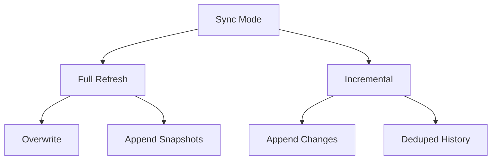

Here's a comprehensive **Master Guide to Data Replication with Airbyte for Data Engineers**, covering all aspects discussed with practical implementations:

---

# 🚀 **MASTERING DATA REPLICATION: AIRBYTE END-TO-END GUIDE**
*For Data Engineers Building Robust Pipelines*

## **1. Core Replication Strategies**
### **Sync Mode Deep Dive**


**When to Use Which:**
| Mode | Storage Impact | Data Freshness | Best For |
|------|---------------|----------------|----------|
| **Full Refresh + Overwrite** | Low | High | Small static datasets |
| **Incremental + Append** | Medium | High | Growing datasets with timestamps |
| **Incremental + Deduped** | High | Highest | Compliance/audit systems |

---

## **2. ERP Pipeline Implementation**
### **Step-by-Step Airbyte Configuration**
#### **Source Setup (PostgreSQL ERP)**
```yaml
# Sample Source Configuration
source:
  type: postgres
  config:
    host: erp-prod-db.aws
    port: 5432
    database: erp_db
    schemas: ["public"]
    tables: ["erp_cust_az12", "erp_loc_a101", "erp_px_cat_g1v2"]
    replication_method:
      method: Standard
```

#### **Destination (S3 Bronze Layer)**
```yaml
destination:
  type: s3
  config:
    bucket: "v1-data-lake"
    path_prefix: "bronze/erp/"
    format:
      file_type: "Parquet"
      compression: "SNAPPY"
    partitioning:
      - field_name: "_sync_date"
        type: "DATE"
```

---

## **3. Advanced Scheduling Patterns**
### **Cron Expression Cheatsheet**
| Frequency | Cron Pattern | Notes |
|-----------|-------------|-------|
| Every 15 mins | `*/15 * * * *` | Max 1440 runs/day |
| Hourly | `0 * * * *` | Top of the hour |
| Daily 3AM | `0 3 * * *` | Low-traffic window |
| Weekdays Only | `0 9 * * 1-5` | Business hours |

### **Manual Trigger Automation**
```python
# Trigger via Airbyte API
import requests

def trigger_sync(connection_id):
    url = f"https://api.airbyte.io/v1/connections/{connection_id}/sync"
    headers = {"Authorization": "Bearer {API_KEY}"}
    response = requests.post(url, headers=headers)
    return response.json()

# Example usage
trigger_sync("abc123-456def")
```

---

## **4. Performance Optimization**
### **ERP-Specific Tuning**
```sql
-- Source DB Optimization
CREATE INDEX erp_cust_az12_sync_idx ON erp_cust_az12 (updated_at);
ALTER SYSTEM SET maintenance_work_mem = '2GB';
```

### **S3 Storage Best Practices**
```bash
# Lifecycle Policy Example (AWS CLI)
aws s3api put-bucket-lifecycle-configuration \
  --bucket v1-data-lake \
  --lifecycle-configuration '
  {
    "Rules": [
      {
        "ID": "MoveToGlacierAfter30Days",
        "Prefix": "bronze/",
        "Status": "Enabled",
        "Transitions": [
          {
            "Days": 30,
            "StorageClass": "GLACIER"
          }
        ]
      }
    ]
  }'
```

---

## **5. Data Quality Framework**
### **Great Expectations Integration**
```python
# Sample Data Test
from great_expectations import Dataset

df = Dataset.from_parquet("s3://v1-data-lake/bronze/erp/erp_cust_az12/")
df.expect_column_values_to_not_be_null("cid")
df.expect_column_values_to_match_regex("email", r".+@.+\..+")
df.save_expectation_suite("erp_quality.json")
```

### **Monitoring Dashboard Metrics**
| Metric | Alert Threshold | Tool |
|--------|-----------------|------|
| Sync Duration | >30 mins | Grafana |
| Rows Synced | <1000 (for ERP) | Prometheus |
| File Size | <10MB or >1GB | CloudWatch |

---

## **6. Troubleshooting Guide**
### **Common Errors & Solutions**
```markdown
1. **"Connection Refused"**
   - ✅ Verify security groups
   - ✅ Check bastion host tunneling

2. **"Replication Slot Not Found"**
   - ✅ `SELECT * FROM pg_replication_slots;`
   - ✅ `SELECT pg_create_logical_replication_slot();`

3. **"S3 Permission Denied"**
   - ✅ Verify IAM role `s3:PutObject`
   - ✅ Check bucket policy
```

### **Log Analysis Patterns**
```bash
# Key grep commands for debugging
grep "ERROR" airbyte.log | grep -i "timeout"
grep "WARN" airbyte.log | grep -i "validation"
```

---

## **7. Security & Compliance**
### **Encryption Setup**
```yaml
# Airbyte Security Config
security:
  source_tls: true
  destination_tls: true
  encryption:
    type: "KMS"
    key_arn: "arn:aws:kms:us-east-1:123456789012:key/abcd1234"
```

### **IAM Least Privilege**
```json
{
  "Version": "2012-10-17",
  "Statement": [
    {
      "Effect": "Allow",
      "Action": [
        "s3:PutObject",
        "s3:GetBucketLocation"
      ],
      "Resource": [
        "arn:aws:s3:::v1-data-lake/bronze/*"
      ]
    }
  ]
}
```

---

## **🎯 Implementation Checklist**
1. [ ] Validate source database permissions
2. [ ] Configure proper sync mode (Full/Incremental)
3. [ ] Set optimal scheduling (cron/manual)
4. [ ] Implement storage lifecycle policies
5. [ ] Add data quality tests
6. [ ] Set up monitoring alerts
7. [ ] Document recovery procedures

---

## **📚 Essential Resources**
1. [Airbyte Connector Development Kit](https://docs.airbyte.com/connector-development/)
2. [PostgreSQL WAL Documentation](https://www.postgresql.org/docs/current/wal.html)
3. [AWS S3 Storage Classes](https://aws.amazon.com/s3/storage-classes/)


*"Data replication isn't just about moving data—it's about creating reliable foundations for analytics."*  
— Senior Data Engineer @ Fortune 500 Company

**Next Steps**:  
[Lab: Build Your First Production-Grade Pipeline](https://github.com/airbytehq/airbyte/tree/master/examples)  
[Community Slack for Support](https://slack.airbyte.io/)


